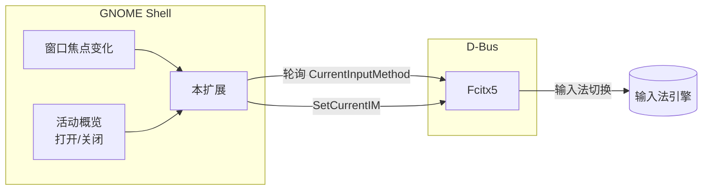

# Fcitx5 Per-Window Input State

在 Gnome Shell 上为每个窗口独立记忆 Fcitx5 输入法状态。

Fcitx5 自带的状态记忆在 Gnome 上完全不可用，猜测是 Mutter 拒绝实现 `zwp_input_method_v2` 协议导致的。与其纠结复杂的输入法协议，不如直接搭桥，曲线救国来得简单。这个扩展作为中间层直接替代 Fcitx5 进行状态管理。

注意：此扩展基本上是 Vibe Coding 产物，无仔细的人工复核，不对稳定性做出保障。

## 功能

| 特性 | 说明 |
|------|------|
| **A — 状态记忆与恢复** | 每个普通窗口独立记录上一次使用的输入法，焦点切换时自动恢复 |
| **B — 用户手动切换的捕获** | 用户通过快捷键或 Fcitx5 托盘菜单手动切输入法时，自动保存到当前窗口 |
| **C — 启动器 / 概览** | 进入 GNOME 活动概览、或聚焦到启动器（Ulauncher、Albert、Rofi）时，强制切回英文，不污染窗口状态 |
| **D — 弹窗继承** | 对话框、另存为等临时窗口自动继承其父窗口的输入法 |

## 工作原理



- 通过 GNOME Shell 的信号监听窗口焦点变化和概览事件
- 通过 D-Bus 与 Fcitx5 通信（服务：`org.fcitx.Fcitx5`，路径：`/controller`）
- 因为 Fcitx5 没有输入法切换的信号通知，所以每 200ms 轮询 `CurrentInputMethod()`
- 设置输入法时有防抖，避免快速切换窗口时产生冲突

## 安装

### 前置条件

- GNOME Shell 50（其他版本未测试）
- Fcitx5 已安装并正常运行
- Fcitx5设置中，`全局选项` -> `共享输入状态` 选择 `所有`
- 保证 `键盘 - 英语（美国）` 位于左侧输入法列表中

### 当前仅支持源码安装

```sh
git clone --depth 1 https://github.com/Yii6724XT/fcitx5-window-state ~/.local/share/gnome-shell/extensions/fcitx5-window-state@yii6724xt
```

安装完成之后注销，重新登录，并通过你的扩展管理器启用扩展。

## 配置

编辑 `extension.js` 顶部常量段：

```js
const LAUNCHER_BLACKLIST = ["ulauncher", "albert", "rofi"];
const DEFAULT_IM = "keyboard-us";    // 默认输入法
const POLL_INTERVAL_MS = 200;        // 轮询间隔（毫秒）
const DEBOUNCE_MS = 80;              // 防抖延迟（毫秒）
const DEBUG = false;                 // 调试日志开关
```

| 常量 | 默认值 | 作用 |
|------|--------|------|
| `LAUNCHER_BLACKLIST` | `["ulauncher", "albert", "rofi"]` | 这些应用获得焦点时强制切英文 |
| `DEFAULT_IM` | `"keyboard-us"` | 默认/回退输入法 |
| `POLL_INTERVAL_MS` | `200` | 轮询间隔，越大越省资源但响应越慢 |
| `DEBOUNCE_MS` | `80` | 快速切换窗口时合并连续设置的延迟 |
| `DEBUG` | `false` | 设为 `true` 后在 journald 输出详细日志 |

### 查看调试日志

```sh
journalctl -f -o cat /usr/bin/gnome-shell | grep '\[fcitx5-ws\]'
```

## 技术细节

### D-Bus 接口

```
服务:     org.fcitx.Fcitx5
对象路径: /controller
接口:     org.fcitx.Fcitx.Controller1
方法:
  CurrentInputMethod() → s    # 获取当前输入法名
  SetCurrentIM(s im_name)     # 设置当前输入法
```

该接口没有输入法变化的信号，因此必须轮询。

### 窗口焦点处理流程

```
焦点变化 →
  ① 如果是启动器应用      → 切英文，不保存状态
  ② 如果是弹窗/对话框      → 继承父窗口的输入法
  ③ 如果是已知窗口         → 恢复上次使用的输入法
  ④ 如果是新窗口           → 初始化为英文
```

## 许可证

[MIT](LICENSE)
